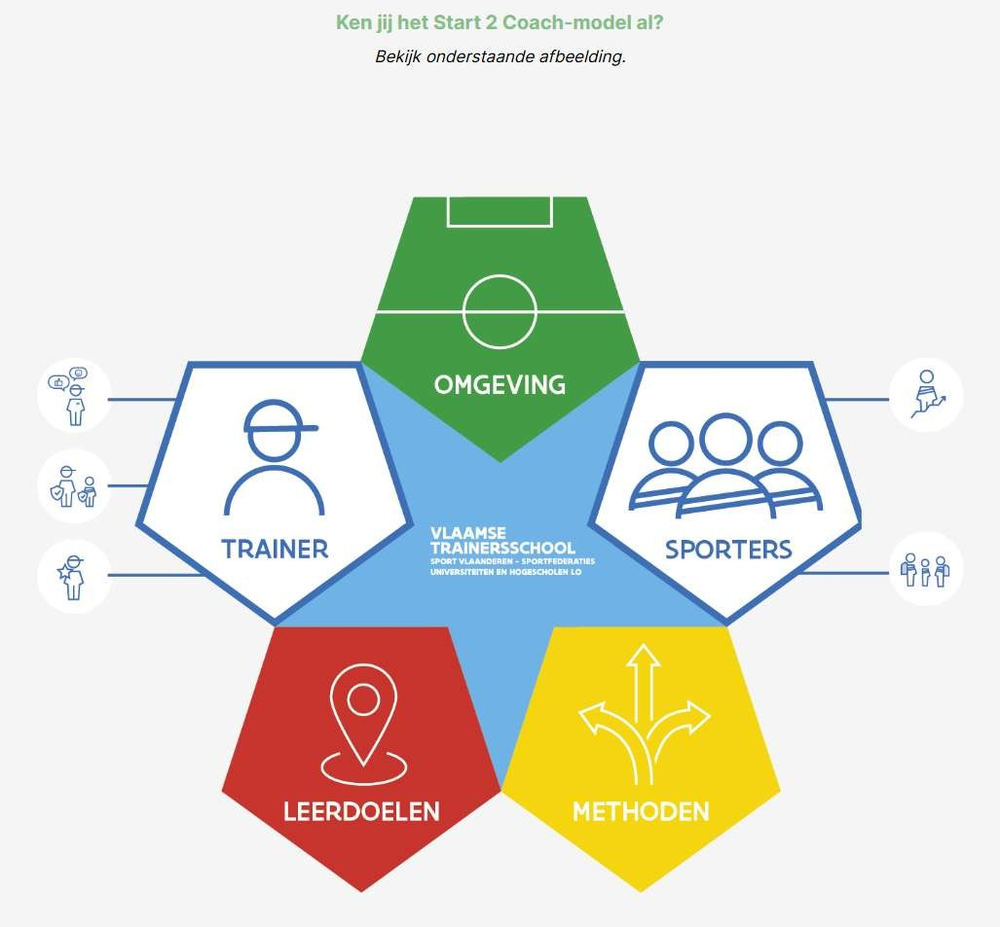

# Start 2 Coach - Introductie

## Wat mag ik inhoudelijk verwachten?

*Les 1 van 3*

Als trainer komt er heel wat op je af: van het motiverend en veilig maken van oefeningen tot het omgaan met verschillende niveaus, blessures of lastige situaties naast het veld. Zeker als beginnende trainer is dat niet altijd eenvoudig.

Met deze Start 2 Coach-module zet je een eerste stap om sterker en zekerder in je rol te staan. Je ontwikkelt basiscompetenties om verantwoord, motiverend en op maat van je sporters training te geven. Zo krijg je de handvatten om met vertrouwen keuzes te maken en met overtuiging in te spelen op wat er tijdens je trainingen gebeurt.

### Basisprincipes rond verantwoord training geven

In Start 2 Coach leer je de basisprincipes rond verantwoord training geven. Zo leer je concreet:

- Hoe coach ik motiverend?
- Hoe zorg ik voor een veilig sportklimaat?
- Hoe ben ik een voorbeeld voor mijn sporters?
- Sporters ontwikkelen zich in hun eigen tempo. Hoe volg ik het tempo van elke sporter?
- Sporters hebben verschillende achtergronden. Hoe werk ik inclusief?
- Hoe pas ik omgeving, leerdoelen en methoden aan mijn sporters aan?

Tijdens de theorie-uren kadert een docent de basisprincipes. Tijdens de praktijkuren oefen je onder begeleiding van de docent deze basisprincipes en leer je ze toe te passen in de praktijk.

### Examenkort

- Verantwoord trainen betekent in deze module: motiverend, veilig en op maat van de sporter trainen.
- De zes centrale thema’s zijn motivatie, veilig sportklimaat, voorbeeldfunctie, ontwikkelingstempo, inclusie en het aanpassen van omgeving, leerdoelen en methoden.
- De theorie-uren kaderen de principes; de praktijkuren dienen om ze onder begeleiding toe te passen.

### Zoekwoorden

verantwoord trainen · motiverend coachen · veilig sportklimaat · voorbeeldfunctie · ontwikkelingstempo · individuele verschillen · achtergronden · inclusie · omgeving · leerdoelen · methoden · differentiatie · blessures · lastige situaties

## Wat is de rode draad in de Start 2 Coach-inhoud?

*Het didactisch model van Start 2 Coach: Trainer, Sporters, Omgeving, Leerdoelen en Methoden.*

De inhoud van Start 2 Coach bouwen we op rond het didactisch model — onze rode draad. Dat model bestaat uit vijf bouwstenen: **Trainer, Sporters, Omgeving, Leerdoelen en Methoden**. Samen vormen ze het fundament waarmee je elke training vormgeeft.

De relatie tussen **Sporters** en **Trainer** staat daarbij centraal.

- In de bouwsteen **Trainer** leggen we de nadruk op **Motiveren**, het creëren van een **Veilig sportklimaat** en jouw **Voorbeeldfunctie**.
- In de bouwsteen **Sporters** staan de **Ontwikkeling** en **Inclusie** van elke sporter voorop.

Deze vijf thema’s — **Motiveren, Veilig sportklimaat, Voorbeeldfunctie, Ontwikkeling en Inclusie** — vatten we samen in de **Pedagogische Pijlers**. Doorheen Start 2 Coach duik je op basis van het model in de verschillende thema’s. Dit gebeurt via korte e-modules in VTS Connect.

### Examenkort

- De rode draad is het didactisch model met vijf bouwstenen: trainer, sporters, omgeving, leerdoelen en methoden.
- Die vijf bouwstenen vormen samen de basis voor het vormgeven van elke training.
- De relatie tussen trainer en sporters staat centraal.
- De pedagogische pijlers zijn: motiveren, veilig sportklimaat, voorbeeldfunctie, ontwikkeling en inclusie.
- Trainer behandelt vooral motiveren, veilig sportklimaat en voorbeeldfunctie; sporters behandelt vooral ontwikkeling en inclusie.

### Zoekwoorden

rode draad · didactisch model · bouwstenen · trainer · sporters · omgeving · leerdoelen · methoden · pedagogische pijlers · motiveren · veilig sportklimaat · voorbeeldfunctie · ontwikkeling · inclusie · VTS Connect

## Het voorbereidingsformulier

Een training geven zonder voorbereiding loopt algauw mis: te weinig oefenstof, een onveilige opstelling van materiaal, sporters die verveeld of verloren rondlopen. Het **voorbereidingsformulier** is het hulpmiddel waarmee je de bouwstenen van het didactisch model concreet toepast op een training.

Het formulier bestaat uit twee delen:

1. **Een checklist vooraf** — een reeks vaste aandachtspunten per bouwsteen, die voor langere tijd geldig blijft en die je voor verschillende trainingen kan hergebruiken.
2. **De uitgewerkte trainingsvoorbereiding** — waarin je stap voor stap plant wat er tijdens de training gebeurt, opgedeeld in opwarming, kern en cooling-down.

| Bouwsteen | Kernaandachtspunt in de checklist |
|---|---|
| **Omgeving** | Ken je locatie en materiaal, en maak het uitdagend én veilig. |
| **Trainer** | Zorg voor motivatie, structuur, blessurepreventie/EHBO en een veilig klimaat; geef het goede voorbeeld. |
| **Sporters** | Houd rekening met aantal, ontwikkelingsleeftijd, niveau en verleden van je sporters; zorg voor verbondenheid. |
| **Leerdoelen** | Kies een uitdagend en bereikbaar doel, hou rekening met de leerlijn, formuleer het duidelijk. |
| **Methoden** | Verzorg tijd, ruimte en groep; kies aangepaste omgangs- en instructievormen; differentieer. |

In de uitgewerkte trainingsvoorbereiding komen deze bouwstenen samen in een tabel met de kolommen **Leerdoelen · Oefenstof (Trainer/Methoden/Sporters) · Materiaal (Omgeving)**, telkens ingevuld voor opwarming, kern en cooling-down.

Volg je Start 2 Coach als losse module, dan leer je een trainingsvoorbereiding vooral **interpreteren** — je stelt er zelf nog geen volledige op. Het formulier is bovendien een **hulpmiddel, geen keurslijf**: tijdens de training zelf stuur je bij als de situatie dat vraagt (bv. een ander aantal sporters, een ander tempo, ontbrekend materiaal).

### Examenkort

- Het voorbereidingsformulier past het didactisch model concreet toe op een training en bestaat uit twee delen: een herbruikbare checklist per bouwsteen, en de uitgewerkte trainingsvoorbereiding.
- De uitgewerkte voorbereiding is een tabel met leerdoelen, oefenstof en materiaal, ingevuld per fase van de training (opwarming, kern, cooling-down).
- Bij Start 2 Coach als losse module leer je een trainingsvoorbereiding interpreteren, niet zelf volledig opstellen.
- Het formulier is een hulpmiddel: tijdens de training mag en moet je bijsturen als de situatie dat vraagt.

### Zoekwoorden

voorbereidingsformulier · checklist per bouwsteen · trainingsvoorbereiding · leerdoelen oefenstof materiaal · interpreteren versus opstellen

## Reflecteren na de training

Een goede voorbereiding maakt het ook mogelijk om achteraf gericht na te denken over hoe de training verliep. Zo sluit de cirkel: **voorbereiden → geven → reflecteren → meenemen naar de volgende voorbereiding.**

Twee hulpmiddelen ondersteunen je daarbij:

- **Globale reflectiefiches** — gestructureerd volgens de vijf bouwstenen van het didactisch model. Ze helpen je telkens door een andere bril naar je eigen handelen en de impact ervan op je sporters te kijken, zowel voor de voorbereiding als het verloop van de training. Vraag hierbij ook actief feedback aan een begeleider of andere trainer.
- **De STARR-methode** — voor specifieke, concrete situaties waar je langer bij wil stilstaan (bv. een ruzie, een gesprek met ouders, een niet-bereikt leerdoel). Vijf fasen:

| Fase | Vraag die je jezelf stelt |
|---|---|
| **S**ituatie | Wat gebeurde er, wie was erbij betrokken? |
| **T**aak | Wat was mijn taak of rol, wat werd er van mij verwacht? |
| **A**ctie | Wat heb ik gedaan, en waarom? |
| **R**esultaat | Wat leverde mijn actie op? |
| **R**eflectie | Wat leer ik hieruit, wat zou ik een volgende keer anders doen? |

### Examenkort

- Reflecteren sluit de cirkel: voorbereiden → geven → reflecteren → meenemen naar de volgende voorbereiding.
- Globale reflectiefiches zijn gestructureerd volgens de vijf bouwstenen en helpen je vanuit verschillende invalshoeken naar je eigen handelen te kijken.
- De STARR-methode helpt je specifieke situaties te ontleden in vijf fasen: Situatie, Taak, Actie, Resultaat, Reflectie.

### Zoekwoorden

reflecteren · globale reflectiefiches · STARR-methode · situatie taak actie resultaat reflectie · feedback vragen

## Niet-opgenomen hoofdstuk

Het derde hoofdstuk over het gebruik van het e-learningplatform is niet inhoudelijk verwerkt, omdat het geen relevante cursusinhoud voor het examen bevat.
